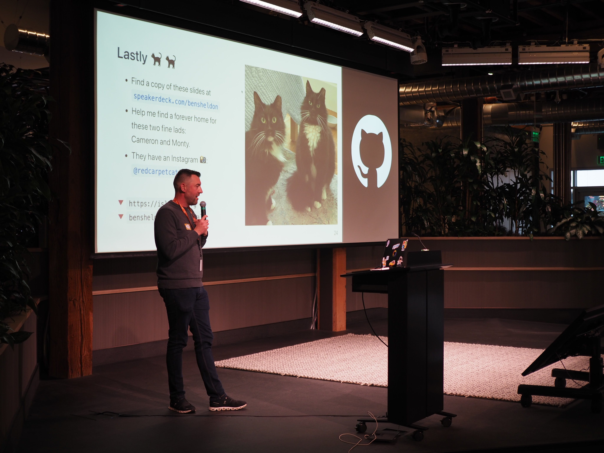

Last week I spoke at the [SF Bay Area Ruby Meetup](https://evilmartians.com/events/sf-bay-area-ruby-meetup), which was hosted at GitHub HQ, which made for an easy commute for me. Here's [the video](https://www.youtube.com/watch?v=9-PWz9nbrT8&t=275s) and [the slides](https://speakerdeck.com/bensheldon/an-ok-compromise-faster-development-by-designing-for-the-rails-autoloader). My talk was entitled "An OK compromise: Faster development by designing for the Rails autoloader"

Also, I haven't shared here the 3 podcasts I did over the past few years. Here they are:

- [The Ruby on Rails Podcast](https://www.therubyonrailspodcast.com/383) from September, 2021.
- [GemRuby Show](https://www.youtube.com/watch?v=DJ9HIjLla_U) from September, 2023.
- [The Ruby Rogues](https://topenddevs.com/podcasts/ruby-rogues/episodes/examining-goodjob-solidq-and-more-ruby-623) from January, 2024.

